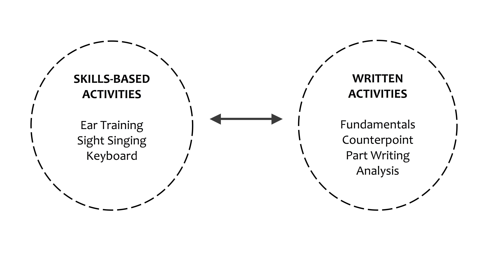
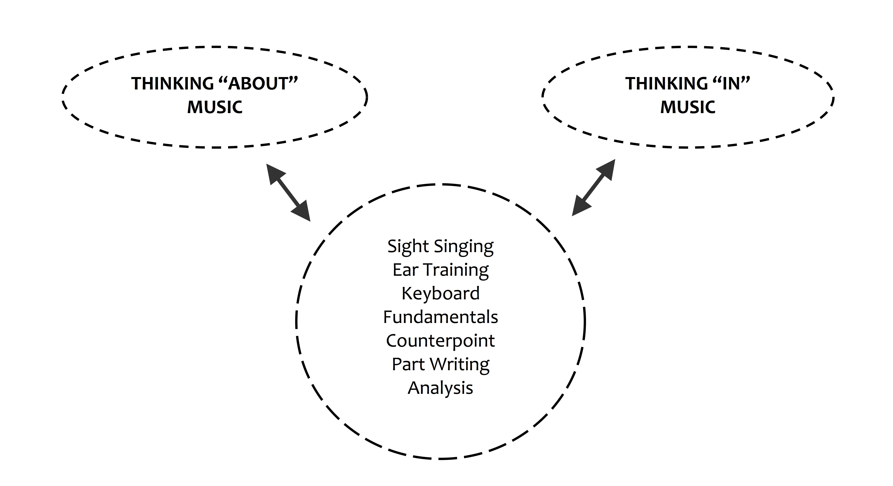

{{ page.title }}
================
**{{ page.author }}**

Music theory training within the North American undergraduate curriculum is usually regarded as dividing into two components—skills training and “written” work. Typically each component is associated with specific subdisciplines within the curriculum; skills training includes sight singing, ear training, and keyboard, while written work normally consists of (at least) fundamentals, counterpoint, part writing, and analysis. These two groups of activities are often taught in separate courses or through a lecture/lab setup within a single course. Whatever the curricular structure, one of our primary tasks as pedagogues is to assure that written work and musicianship skills inform one another as closely as possible ([Rogers](https://www.google.com/url?q=https%3A%2F%2Fopenlibrary.org%2Fbooks%2FOL3471054M%2FTeaching_approaches_in_music_theory&sa=D&sntz=1&usg=AFQjCNH0Y8cAy2_OAze4ZyDcAhhxIrdkmA)). Figure 1 shows the bipartite grouping of subdisciplines, with a bidirectional arrow indicating their mutual influence.

**Figure 1**. *Framework for relating the subdisciplines
within the theory curriculum: “Bipartite” Model.*

The often-heard exhortation to integrate skills and written work within our teaching, however, hints at a possible problem with the bipartite conception itself. It is as though this way of thinking about our subdisciplines is non-integrative in some sense, and that we must make a special effort to overcome that. This essay will propose an alternate way of configuring the activities shown in Figure 1, with the hope of establishing a firmer foundation for integrating them. I will start with a few observations about the bipartite model in Figure 1, which will in turn suggest a way forward towards an alternative.

The bipartite grouping in Figure 1 implies something that seems dubious if taken at face value: insofar as it assigns only some of the subdisciplines to “skills,” it suggests that the remaining subdisciplines—i.e, in the “written” category—are not about skills. Yet that seems wrong. For instance, consider part writing; certainly that involves a skill of some sort. But this triggers a new question (staying with part writing as a stand-in for written work in general): what kind of skill does part writing require, and how does that skill relate to a musicianship skill such as ear training? 

For the sake of comparison, let’s consider a typical harmonic dictation exercise in which students notate the outer voices and provide a Roman numeral analysis. Here we can elaborate in some detail what kind of skill is required of the student, which may provide us with a basis for evaluating the skill(s) needed for part writing. How do we as instructors respond when we see that a student is encountering difficulties with a harmonic dictation? Invariably we diagnose what we think the problem is with respect to some subskill. If a student misses one of the pitches in the soprano, say, I might ask him to listen for its scale degree, or to identify the melodic interval leading to it. We find a comprehensive treatment of such subskills in [Gary Karpinski’s Aural Skills Acquisition](https://www.google.com/url?q=https%3A%2F%2Fopenlibrary.org%2Fworks%2FOL5736751W%2FAural_Skills_Acquisition&sa=D&sntz=1&usg=AFQjCNELhXpV3Zni9YDgJwvCmB1Gxcr_ZQ); for instance, his list of subskills for hearing pitch structure includes pitch matching, pitch memory, memory of pitch collections, perception of melodic contour, identification of scale degrees, and identification of intervals. Note that all of these subskills have something in common: they involve musical experience in the form of sound images. In [Steve Larson’s](https://www.google.com/url?q=https%3A%2F%2Fopenlibrary.org%2Fworks%2FOL16142046W%2FMusical_forces&sa=D&sntz=1&usg=AFQjCNEZpcbostSatUT6I-xEyV0zrAUjCw) words, they entail thinking in music: “When we respond to music aurally—by auralizing pitches and durations—we are thinking in music; when we respond to music intellectually, we are thinking about music” (30). Larson’s use of the word “auralizing” recalls [Edwin Gordon](http://www.google.com/url?q=http%3A%2F%2Fgiml.org%2Fmlt%2Faudiation%2F&sa=D&sntz=1&usg=AFQjCNH_D2ntRgaEmLEQFkaGq6ygcoAr6w)’s term audiation, which Gordon defines as “hear[ing] and comprehend[ing] music for which the sound is no longer or may never have been present.” In the following discussion I will treat Larson’s “thinking in music” and Gordon’s notion of audiation as functionally equivalent.

Our brief foray into the world of harmonic dictation provides a foothold for thinking about the kinds of skills involved in part writing. Like harmonic dictation, it can be broken down to a series of subskills—for instance, the ability to spell chords accurately based on a provided figured bass; to prepare and resolve chordal sevenths appropriately; to use mainly smooth voice leading without writing forbidden parallels; and so on. Observe that these subskills, and any others we might associate with part writing, are easily summarized through a checklist (usually reformulated as directives to the student).

But is a part-writing checklist really a “skill set” in the same sense as Karpinski’s? In one important sense, no. Recall that all of Karpinski’s subskills require audiation; that is their very essence. This is not true of the checklist, which normally includes no reference to audiation. To be sure, the student may audiate while applying the rules, and we may want her to, but she can notate a perfectly acceptable solution without audiating anything. Thus the checklist tells the student how to think “about” the part-writing task, without actually requiring any thinking “in” music.

Perhaps this is not a cause for alarm. After all, one can learn quite a lot “about” harmony and voice leading from part writing. Yet this view gives rise to considerable cognitive dissonance. Don’t we repeatedly stress the importance of experiencing what it means to follow (or not follow) the part-writing guidelines, and demonstrate that for students on the keyboard? And don’t we have our students sing progressions in class, or tell them to play the solutions themselves? 

One way of dealing with this cognitive dissonance is simply to be vigilant and proactive; we should push against the non-integrative implications of a “skills-vs.-written work” conceptualization, as Rogers implicitly counsels. However, I would argue for a different tack. We can instead alter the conceptualization that guides our thinking in the first place. Perhaps we can replace the bipartite conceptual model with one that explicitly acknowledges both modes of musical thought in written work. Such an alternate global model gains added attraction if we consider that our skills-based activities already combine the two “thinking” modes. For instance, if our hypothetical student wishes to use scale-degree function to find a missing pitch in the soprano, she first mentally hears her way through scale-degree space to identify the scale degree (thinking in music), and then reasons along the lines of “given that the key is B-flat major, this pitch must be G” (thinking about music). In fact, such blending of the audiational and conceptual modes is an essential aspect of any “skills”-related activity, including sight singing and keyboard. 

Figure 2 shows my alternative to the bipartite conceptualization shown earlier in Figure 1. Note that this "unitary" model now assigns all the subdisciplines to a single realm, rather than to opposite sides of an epistemological divide. The twofold division of the first model does not disappear, but is now transmuted at the highest level into a binary distinction between the two modes of musical thought. Both modes in turn infuse each of the subdisciplines, which now are understood to be arenas for the dialectical play of thought and audiation-based experience. In actual practice, the two modes may interact so fluidly that they are difficult to disentangle. Ultimately, the developmental goal is a (virtual) fusion of the two thinking modes within each subdiscipline. 

**Figure 2**. *Alternate framework for relating the subdisciplines within the theory curriculum:
The “Unitary” Model.*

The test of any pedagogical model is its entailments. Does it have practical ramifications that testify to its scope and power? I believe that the unitary model does. Here are a few examples:

-   Audiation training would receive high priority within the theory curriculum ([Klonoski](http://jmtp.ou.edu/journal-article/teaching-pitch-internalization-processes), [Covington](http://symposium.music.org/index.php?option=com_k2&view=item&id=2216:the-minds-ear-i-hear-music-and-no-one-is-performing&Itemid=146)), since that skill now bears on all of the subdisciplines.

-   Since audiation itself is a skill, we would need to devise a long-range plan for training it. Such a developmental plan would need to engage all the subdisciplines in an integrated way; in addition, it would intersect with, but be distinct from, the traditional content-based path shown in a typical course syllabus.

-   The recognition of both modes of musical thought across the subdisciplines would be reflected in how we assess the students’ abilities. “Doing” music (for instance, through singing or keyboard work) now has the same inherent value as pencil-and-paper work. (Peter Schubert has described such an activity-driven approach for counterpoint pedagogy in [volume 1 of this journal](http://www.google.com/url?q=http%3A%2F%2Fwww.flipcamp.org%2Fengagingstudents%2Fschubert.html&sa=D&sntz=1&usg=AFQjCNHWU6wL0p_qdFS3fkoq9QiqpqIK8g)[.](http://www.google.com/url?q=http%3A%2F%2Fwww.flipcamp.org%2Fengagingstudents%2Fschubert.html&sa=D&sntz=1&usg=AFQjCNHWU6wL0p_qdFS3fkoq9QiqpqIK8g) See also his article [“Global Perspective on Music Theory Pedagogy: Thinking in Music”](http://www.google.com/url?q=http%3A%2F%2Fjmtp.ou.edu%2Fjournal-article%2Fglobal-perspective-music-theory-pedagogy-thinking-music&sa=D&sntz=1&usg=AFQjCNHmzksub2kzDqISntyqJsAigUCK5A).)

With respect to part writing in particular:

-   The unitary model addresses the deeply problematic role of part writing in undergraduate theory training. For too many of our students, it is a meaningless activity that has no bearing on experience (or vice versa). A unitary conceptualization views this as an unacceptable state of affairs; to put it in a positive way, the model grants a central role to audiation within the part-writing regimen.

-   Given the challenges of audiating an SATB texture, we might want to think carefully about when and how to introduce part writing within the curriculum.

-   Since it is especially difficult to audiate four voices at once, we could encourage students to use hybrid strategies that combine thinking "in" and "about” music--say, by audiating the soprano and/or bass, while falling back on the "rules" if necessary for the inner voices.

-   Keeping in mind that audiation involves the ability to hear aural images in the absence of an actual sounding signal, we would urge students to use the keyboard to develop their audiation skills—specifically, by audiating their solution (to the extent possible) ahead of time, and thenchecking that sound image against what they play.

To sum up, the unitary model promotes an integrative music-theoretical understanding in which the conceptual is closely intertwined with the experiential—not only in our “skills-based” subdisciplines, but also in our written work. I believe that following through on the entailments of this model can enrich and deepen our students’ theory training. Just as important, it also can bring their written work into closer contact with their experiences as performers and listeners.

This work is copyright ©2014 Roger Graybill and licensed under a [Creative Commons Attribution-ShareAlike 3.0 Unported License](http://www.google.com/url?q=http%3A%2F%2Fcreativecommons.org%2Flicenses%2Fby-sa%2F3.0%2F&sa=D&sntz=1&usg=AFQjCNG4j2oPozXv2_VqmmLiVAToFtwKdA).

