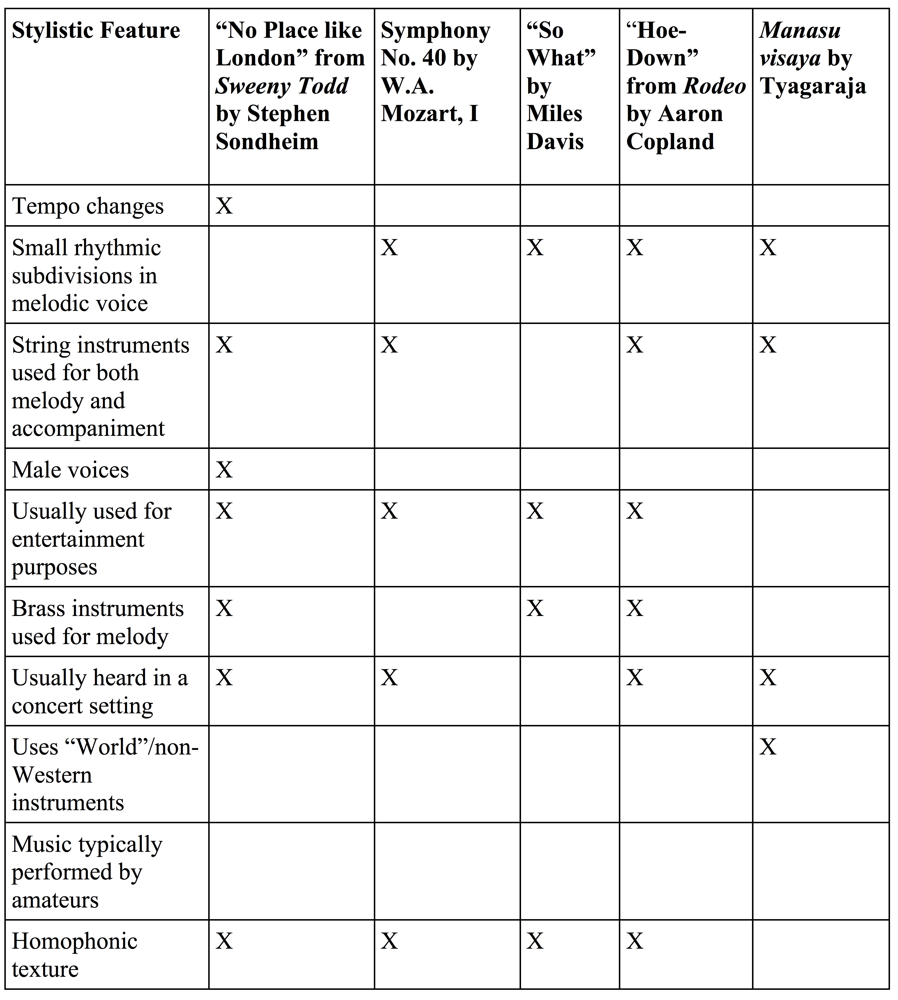

{{ page.title }}
================
**{{ page.author }}**

## Appendix 2&#58; Final Assignment

We’ve taken a variety of approaches to studying music this semester, including:

-   Music and Ethnicity,
-   Music and Gender,
-   Music and Spirituality,
-   Music and Politics,
-   Music and War,
-   Music and Love,
-   Music and Art,
-   Music and Literature, and
-   Music and Narrative.

Because music is inherently social(the first fundamental and powerful concept of this class), we can relate pieces/songs we’ve studied to multiple topics, creating different meanings from the same piece of music (the second fundamental and powerful concept of this class).

Building on this work, the first part of this assignment involves selecting ten (10) different pieces/songs that we studied this semester (either in class or that were included in the textbook). For each of these pieces/songs, answer these questions:

1.  Which unit did we originally study the music in? Why?
2.  What is another unit that we could have studied the music in? Why?

For example:

1.  We discussed Alexander Borodin’s *In the Steppes of Central Asia* in our Music and Politics unit because of the political aspects of 19th century European nationalism.
2.  We could have discussed this piece during the Music and Ethnicity unit (because of its constructions of Russian and Asian identities), or during the Music and Narrative unit (since the piece tells a story through the travels and interactions of the three main themes).

Next, focus on one of your answers from above. For one of these pieces/songs, answer this question:

1.  What specific musical evidence can you give to support your argument for including this piece/song in a different unit?

For example:

1.  We discussed Moore’s “Ballad of the Green Berets” during the Music and War unit, but we could have discussed this piece during the Music and Gender unit. The song does many things to construct a masculine identity for the narrator. Lyrically, the men are portrayed as brave, fearless, loyal, honest (“Men who mean just what they say”), as “America’s best,” as elite and skilled (because of the testing and rigorous requirements for joining—“only 3 win the Green Beret”), courageous, willing to fight and die for their ideals (“he has died for those oppressed”), tough (the line “Her Green Beret has met his fate” uses the word “fate,” which makes it seem that the men are so tough and so well trained that only fate––something preordained from some higher power––can end their lives (not an enemy soldier, an accident, etc.), and dedicated (his willingness to have his son fight and possibly die). Musically, the song reinforces these lyrical ideas. Instruments like a snare drum and trumpets have associations with war, leading us to hear these instruments as “manly.” The lead singer is a man, but he does not croon or sing emotionally (he doesn’t use vibrato or bend his voice into any of the pitches like any of the blues singers we talked about; rather, he sings each note clearly and plainly, without excessive, “feminine” displays of affection). The melody is clear and direct, almost exclusively on the beat with little syncopation, much like the men the text describes (“Men who mean just what they say”). When additional singers enter, they are all men. Finally, the organ reinforces lyrical references to family and constructs ideas of men being traditional, stable, religious, faithful, loyal, etc.

For the **second part** of this assignment, complete this defining features matrix. This matrix needs to have ten (10) stylistic features, six (6) of which should be musical. The other four (4) items can either be musical or social (who uses the piece, what they use it for, etc.). If you need inspiration, use our listening framework––what instruments/voices you hear, what texture you hear, etc.

For example:

