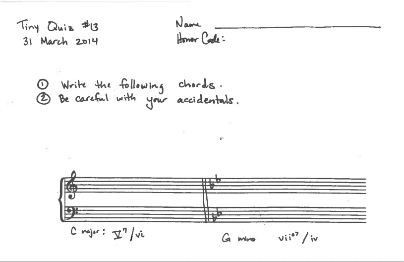

{{ page.title }}
================
**{{ page.author }}**

A mini-flip is an easy first step into the world of flipped music theory classrooms. Compared to the basic flip as described by [Kris Shaffer](http://www.google.com/url?q=http%3A%2F%2Fwww.flipcamp.org%2Fengagingstudents%2Fshafferpt1.html&sa=D&sntz=1&usg=AFQjCNELSwj3ueETEr7uAPk_cxOMwNx7mw), the mini-flip scales down everything but the learning, including the risk to the professor if it does not go well, time spent creating materials, and amount of lecture time moved from class to a video/podcast.

Flipped classrooms are not a new approach to technologically-enhanced teaching. Many musicians practiced transcriptions from cassette tapes, J. Wesley Baker published [one of the earliest scholarly articles](http://www.google.com/url?q=http%3A%2F%2Feric.ed.gov%2F%3Fid%3DED440975&sa=D&sntz=1&usg=AFQjCNGCiOJI5GD2W-NtijZjxC2IwW5o5g) on the topic in 2000, and my sister began providing CDs with laboratory preparation work to her chemistry students in 2002. The creation of podcasting technology, electronic distribution, and course management systems significantly decreases the amount of labor necessary to flip a classroom. As a result, most students run into a podcast or videocast within their first year of school through a wide range of activities including enrolling in a fully flipped classroom, watching professor-assigned TED talks that accompany readings, or  searching for supplemental materials on the internet. Podcasting even plays a role in the national conversation on MOOCs; the concept of a blended (a.k.a., flipped) classroom is [gaining traction](http://www.google.com/url?q=http%3A%2F%2Fwww.ted.com%2Ftalks%2Fanant_agarwal_why_massively_open_online_courses_still_matter.html&sa=D&sntz=1&usg=AFQjCNFYXNkbWcG1Cz_NY3T1JiRGJz6LKw) as a way to increase MOOC students’ engagement.

This mini-flip approach to podcasting is inspired by a year of volunteering in a kindergarten classroom and reflecting on a huge challenge that kindergarten teachers face: they are presented with a classroom of students who range in pre-existing knowledge from recognizing only a few letters to reading at a second-grade level.  Watching the teacher create a classroom of learners was fascinating and humbling. It was easy to see parallels in the music theory and aural skills fundamentals classrooms.  Some students come in with perfect pitch and a nuanced understanding of notation.  Others come in with great pitch and no experience with notation.  Still others enter with great sense of rhythm, but no experience with pitch or notation. Yet they often end up in the same class. It is difficult to figure out how to keep the most knowledgeable students challenged while providing the least experienced students a classroom in which they can take risks and learn effectively.

A well-constructed and implemented podcast ensures that all students can be at square 2—rather than square 1 or square 0—before class starts. For the least experienced students, a good podcast is essential because they can revisit it many times and build confidence before entering the classroom. For the most experienced, it helps organize their pre-existing knowledge so that they can participate at a level appropriate to the class. Furthermore, these more experienced students spend less time listening to some of their classmates ask rudimentary questions. Being able to assume a modest corpus of shared knowledge when class starts creates the flexibility to use class time for moving forward in depth, nuance, detail, and general musicality. In other words, podcasting allows instructors to incorporate more active learning and guide students through the process of transferring knowledge from the podcast into music they study.

As with all pedagogical techniques, the setup is key. On Philip Duker’s production time vs. longevity axis, a mini-flip is situated in the extreme lower left-hand corner because it is conceived as a one-time podcast that takes little time to make.

**Figure 1.** *Philip Duker’s Production Time vs. Longevity Axis.*

Here are six tried-and-true guidelines for creating and incorporating podcasts into a mini-flipped course:

​(1) Aim for a podcast with a length of five minutes or less.  If one cannot explain the basic concept in five minutes, then it is probably too complex for a podcast and needs to be worked through in class.

​(2) Perhaps most important, reverse engineer the podcast. Before recording, write down one sentence describing what a student should be able to do after listening to the podcast.  Provide yourself two to three bullet points that accomplish that goal and organize the five minutes. Make the learning objective the first (or second) sentence of the podcast and then proceed to deliver the necessary content.

​(3) Consider providing a simple handout or link to a good website.

​(4) Allow only two takes.  It will not be perfect and it will not be ultra professional. That's ok. Assuming only your students are listening, they generally see the professional side of you at school and enjoy hearing you in a more informal setting. Figure 2 and Example 3 would be used for the same lesson in Music Theory 2. Figure 2 is a screenshot of what students see in their course management system (Blackboard, in this case). Example 3 is the podcast, created using GarageBand.

**Figure 2.** *A course management system presentation of a podcast.*

**Example 3.** *[Example of a podcast from Theory 2.](https://drive.google.com/file/d/0B5EJ9_DmZ6CBVDRTTkVyU3drVFk/edit?usp=sharing)*

​(5) Always hold students accountable for the content of a podcast by following it with low-stakes (pass/fail) testing. As discussed in a [recent New York Times article](http://www.google.com/url?q=http%3A%2F%2Fwww.nytimes.com%2F2014%2F07%2F20%2Fopinion%2Fsunday%2Fhow-tests-make-us-smarter.html%3Fref%3Dopinion%26_r%3D1&sa=D&sntz=1&usg=AFQjCNHhLG-QpyREnPNxYEZqze5zBiTUOQ), “used properly, testing as part of an educational routine provides an important tool not just to measure learning, but to promote it.” Knowing they will be evaluated with a short quiz ensures that there is a downside for students who do not take the podcast seriously.  Consider giving the quiz right when class starts and adhering to a pre-advertised, strictly enforced time limit—five minutes is usually sufficient. Students will work to build fluency and get answers to basic question before class starts. Enforcing a time limit guarantees the instructor does not lose class time to testing and has a small amount of time to return assignments and take care of other administrivia while students work. The short quiz also can help decrease tardiness. Figure 4 provides the tiny quiz given the Monday after Spring Break on the applied chords podcast. There is nothing tricky about this three-point quiz.  Passing grades resulted from earning ⅔ or more of the total points.

**Figure 4.** *“Tiny Quiz” on podcast.*

​(6) Include a "nuts-and-bolts" homework dependent on the contents of the podcast. These assignments should engage students on the three lowest levels of knowledge: remembering, understanding, and applying. Using [verbs associated with Bloom’s taxonomy](http://www.google.com/url?q=http%3A%2F%2Fanethicalisland.wordpress.com%2F2014%2F06%2F05%2Fblooms-revised-taxonomy-with-verbs%2F&sa=D&sntz=1&usg=AFQjCNFggYnlp29uv7ZFjK_Vi1PkrhfrBg) helps in writing nuts-and-bolts assignments and planning in-class activities based on the higher levels of knowledge. Figure 2 contains the nuts-and-bolts homework that was attached to the information in the podcast.

After two full semesters of using podcasts, I am completely sold on their value. I find that students enter the classroom with well-articulated specific questions. The quizzes ensure that students use the resource that I spent time on. I am more engaged with my teaching because what used to be considered supplementary is now front-and-center. Specifically, I have time to interact with entire pieces instead of small excerpts. I regularly have the opportunity to talk about form, contour, timbre, texture, rhythm, and meter. And, I have been able to develop pedagogies that teach students how to [ask good questions](http://www.google.com/url?q=http%3A%2F%2Fteaching-matters.net%2Fskill-asking-questions%2F&sa=D&sntz=1&usg=AFQjCNH2N_QKyDXrOMVJRCv4v1M-WSrxhQ) about music that are answerable by music theory.  This skill better prepares them for advanced music theory classes and helps them understand how theory might be helpful to them after they graduate.

The low production-value of this approach also has two hidden advantages. Owing to the small amount of time investment, the podcast comes across as less formal than a high production-value podcast; as such, it builds on and contributes to the rapport an instructor has with a class. Also, since it is easily redone each semester, one can use cultural references and adjust for semester-by-semester differences in class rapport.  

Once upon a time, students would do reading over the weekend and could be quizzed on it at the beginning of class. For my students, podcasts seem to be more effective. They are more personal—literally containing a familiar voice—and they can engage aural and kinesthetic learners by facilitating unlimited hearings for the aural learners and a pause button for kinesthetic learners to work through their notes, arranging ideas into tables and/or diagrams.

## Conclusions

A mini-flip is only one of many ways to engage with technologically enhanced teaching. The importance of stating pedagogical goals is essential to effectively employing technology. Since it opens up new paths and enhances old ones for realizing our intentions, evaluating how well it helps us accomplish our pedagogical tasks is the only way to know whether our approach is worthwhile. If you lose sight of your goals, then you run the risk of using technology for technology’s sake, instead of for pedagogical value.

Sometimes it is difficult to decide whether it is worth continuing a teaching experiment. I have developed a basic three-question process that I use to help me make that decision.  I choose to continue an experiment—technology-related or not—when it helps me teach better; I define better first by asking two questions of myself: “Are my students more deeply engaged with the course materials?”, and “Is my teaching of basic facts and skills more effective?” A yes answer to at least one of those questions leads to a final question: “Is the amount of time I put into the new activity worth it?”  If the answer to that final question is yes, then I keep the activity. The mini-flip definitely made the cut.

This work is copyright ⓒ2014 Jan Miyake and licensed under a [Creative Commons Attribution-ShareAlike 3.0 Unported License](http://www.google.com/url?q=http%3A%2F%2Fcreativecommons.org%2Flicenses%2Fby-sa%2F3.0%2F&sa=D&sntz=1&usg=AFQjCNG4j2oPozXv2_VqmmLiVAToFtwKdA).

