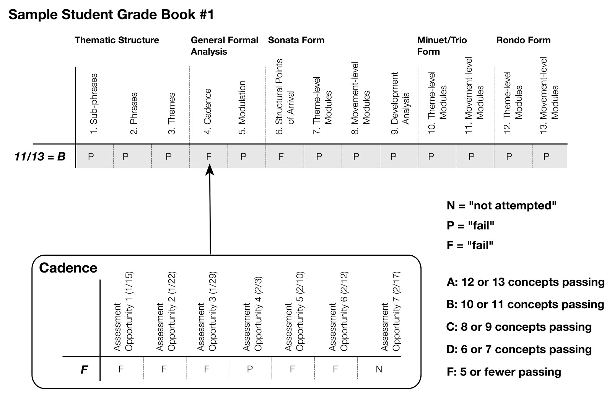
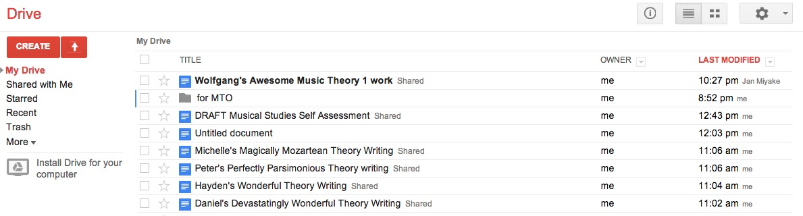

{{ page.title }}
================

**{{ page.author }}**

When we listen to the opening of Beethoven’s String Quartet, Op. 18, No. 4, which you can hear in [this recording](http://www.google.com/url?q=http%3A%2F%2Fpetrucci.mus.auth.gr%2Fimglnks%2Fusimg%2Fd%2Fde%2FIMSLP243530-PMLP04332-beethoven_op18no4.mp3&sa=D&sntz=1&usg=AFQjCNHL_7G7mZYTf9A1p7diiPM-gBY2AQ) by the Orion String Quartet, much of the tension springs from cadential moments that have little ultimate significance in articulating the sonata form’s larger thematic modules. The “declined medial caesura” (at 0:44) is perhaps the most famous example, but a good case could be made that this moment is part of a dialogue with earlier passages, stretching back to the evaded cadence that extends the opening sentence (at 0:16), and which vaults the first violin up an octave. That sentence’s cadential conclusion compensates for the delay in the most emphatic manner through a powerful “cadential extension” (from 0:23–0:29). But even this moment continues the movement’s forward propulsion as its *intrinsic characteristics* allow it to function as both a cadential extension and as the initiating presentation of the following theme.

I find that listening to classical music in this way, through the lens of formal structure and process, is rewarding in part because it requires my active participation. I’m constantly asking how local events, like the cadential extension above, interact with my understanding of the location of those events in comparison with some paradigmatic form and what I should expect to come next. Teaching students to hear music in this way is one of the most rewarding experiences in the undergraduate curriculum. They learn how to involve themselves in a listening experience, but on a more basic level, when students listen to classical form they have the opportunity to work with complete pieces of music, and gain exposure to great and varied recordings. Learning to listen actively to classical form also has the potential to be a richly integrated experience because it draws on [musical knowledge, experience, and intuition](http://www.google.com/url?q=http%3A%2F%2Fwww.flipcamp.org%2Fengagingstudents%2Fgawboy.html&sa=D&sntz=1&usg=AFQjCNEmuGP7NpoBme7MwEIw8FVH1VlqUA).  

But of course, active listening of this type is a complex activity. At a basic level students need an ingrained conceptual understanding of classical form, and they have to develop new listening skills. Most difficult amongst these new skills is the ability to shuffle between narrowly-focused and more broadly-oriented streams of thought; that is, they need to be able to create connections between local, salient musical events and larger formal procedures, such as the cadential evasion I described above and its relationship to the declined MC.

My goal here is to describe how criterion-referenced assessment (sometimes called “standards-based” assessment) can be a helpful way to teach this kind of active, analytical listening in a classical form unit. Of course, assessment policies are just one part of teaching a successful class, but as students have become more grade-conscious in recent years, I think that how we evaluate them often determines what they value. Below, I’ll describe some conceptual advantages of criterion-referenced assessment, particularly in the context of teaching students to listen to classical form, and outline how I have made it work in practice. Implementing a classical form unit into an aural skills class poses its own practical difficulties, including problems of notation, assignment submission, grading, and so on. Throughout I’ve included links to resources that describe how I have dealt with some of these problems.

# Establishing a Conceptual Basis for Your Course

As I hope I captured in my description of the opening of Op. 18, No. 4, my hope is that students would learn to move between local and global modes of listening, and that they would find as much or more significance in salient moments as in large organizational schemes. But my experience has show that this is not usually the case. As students learn to hear larger spans of music, their attention broadens as well—as a result, thematic modules and large-scale formal goals take on outsized significance in their minds.

We can encourage more active listening by aligning listening opportunities with a set of formal concepts that also form the basis for student evaluation. [Criterion-referenced assessment](http://www.google.com/url?q=http%3A%2F%2Fkris.shaffermusic.com%2F2012%2F08%2Fintroduction-to-criterion-referenced-grading%2F&sa=D&sntz=1&usg=AFQjCNFGQgI-kO8qmJObwjkr0JxKEA9QZg) (CRA) evaluates student work according to a set of standards, concepts, or skills. Those criterion form the basis for the student’s grade—as opposed to “assignments” and “quizzes.” Typically, students receive multiple grades on an assignment that reflect their performance on the of relevant criteria. A primary intention is to measure *understanding* or *mastery* of a set of criteria that a teacher believes to be relevant to the larger goals of the course. (With my students, I describe CRA as something like a driver’s test, where each of the skills tested—signaling, changing lanes, and so on—is necessary in order to show ability to drive.) Here are the thirteen concepts I expected my students to master in my unit on classical form:

These thirteen concepts reflect the building blocks of formal structure at multiple levels and encompass three different movement types. My belief is that students that master each of these concepts will be able to listen to and interpret classical form effectively. Teachers might also include performance skills, such as the ability to improvise a consequent phrase given the antecedent, or composition skills, perhaps including the ability to compose a short phrase for piano given one of Robert Gjerdingen’s *schemas*.

# Using Concepts to Guide Listening and Assess Work More Effectively

In my course, students were told which concepts were relevant each time they were assessed. Because students  received multiple grades that reflect their performance on each of the concepts, they are coaxed into treating local and global levels of form equally. Consider the following assignment, which assesses student understanding of “sentence,” “period,” and “hybrid” types of phrase:

[Resource: Using Variations Audio Timeliner in your Classical Form Unit](https://docs.google.com/document/d/1FK4SI6tQtRHI0w56CR9dM9Yc9zm6TsPlHdTRcgeVod8/edit)

This assignment puts emphasis squarely on the four categories that comprise thematic structure, and encourages students *to listen through a particular path*. Because students often listen too “broadly” at first, in the initial stages, I prefer that students begin their listening at the lowest level and work their way up to the theme type.

Criterion-referenced assessment makes grades carry greater information. This particular assignment would receive four grades, one for each of the concepts. This student submission of the above assignment—annotated with my comments—offers an example:

[Thematic Structure Submission](https://drive.google.com/file/d/0B0_DrOo8gCUrMjQ2QnNRcmFDUVk/edit?usp=sharing)

Establishing a particular pathway for listening makes it easier to diagnose conceptual problems. At first glance, this student seems to have done poorly. There are multiple errors in the melodic/motivic categories, including mislabeling the theme type of the second excerpt (in orange; it should be a “period”) and the initiating phrases of the first, second, and third excerpts (in yellow; they should all be antecedents). But because I asked the student to listen through a particular pathway—beginning at the sub-phrase and cadence levels and working up to the phrase and theme type—its easy for me to isolate the errors in cadential identification as the root of those mistakes: labeling the initiating phrases of excerpts \#1, \#2, and \#4 as “compound basic ideas” seems to have occurred *not* because of a misunderstanding of that concept, but because the student did not hear cadences at the ends of those phrases.

Given a particular listening pathway, a CRA grade sheet can capture *conceptual* misunderstandings at higher formal levels in relation to lower ones. Below is the grade sheet for the student assignment above, where the student was asked to listen from the cadence and sub-phrase levels up.

[Resource: Using Google Drive to Automate the Creation of CRA Grade Sheets](https://docs.google.com/document/d/10Wm3mLSpSIVQbibIdYDSy98_Co4N5BAWZ23sBk2UT70/edit?usp=sharing)

In this case, the student is not penalized for phrase and theme labels because those were consistent with the lower levels of analysis. Even though these answers are inconsistent with the actual musical material, the student has shown an understanding of the way that phrase and theme are dependent on sub-phrase and cadence that is consistent with what he or she “thought” she heard.  

Without a “headline” number giving a single grade for the assignment, students are  forced to reckon with the particular musical concepts or skills that they are  struggling with. And as an instructor, it becomes simpler to design exercises, class activities, or lectures that isolate particular problems. (Anecdotally, I can report that prior to using CRA in my courses, students would often complain that a *particular assignment* was keeping them from getting a good grade, but since implementing CRA, students complain about difficulty with *particular skills*. As complaints go, the latter is a far superior in my opinion!)

As students learn to listen to classical form in this way, they quickly learn that large organizational structures are *dependent* on smaller ones for their meaning. Sub-phrase patterns and cadences create phrases, for example, in the same way that theme types structure thematic modules.  Establishing this dependence is an important way to ensure that students relate surface moments to large-scale structural patterning.  

Students, of course, learn this dependence at different paces, which may or may not conform to the pace of our class in general. CRA allows you to easily tailor assessment opportunities to students’  ability levels—allowing students that learn quickly to move on, and those that need extra time with a concept to linger behind. The following assignment, which asks students to diagram a sonata exposition, allows students to determine the concepts they’d like to have assessed based on prior performance. Students that have already mastered sub-phrases and phrases are allowed to leave those concepts are allowed to skip over those concepts, while others can continue to practice those skills.

#vCRA as a Way to Fuse Written and Aural Skills

In my experience, blending written theory and analysis with analytical listening encourages the development of what Bruce Benward called the “hearing eye” and “seeing ear”—which is especially important as students learn to visualize the formal structures they are hearing. CRA can better fuse these two aspects of the curriculum by unifying the conceptual objectives in the two courses: in a classical form unit, written and aural theory can share the same core concepts.

Fusing written and aural theory through *concepts* helps in other ways as well: I have found that a student’s conceptual understanding of form only sometimes predicts that student’s ability to hear form in such a way, and vice versa. In the thematic structure assignment above, did the student struggle because he or she didn’t hear the cadences or because he or she didn’t understand them? Integration can help students buttress deficiencies in one area by utilizing their abilities in the other. (See [Roger Graybill's essay]({{ site.baseurl }}/essays/graybill.html) in this volume for more on integrating "written" and "aural" musical study.)

# Assessment Options

Because mastery of concepts is the goal of a CRA class, many implementations of this type of assessment evaluate performance on a “pass/fail” basis, count only the most recent attempt in the final grade, and assign a final grade based on the number of concepts mastered. As an example, the first grade book below, which resembles [Kris Shaffer’s approach to teaching a similar course](http://www.google.com/url?q=http%3A%2F%2Fkris.shaffermusic.com%2Fcourses%2Fmt4-unit1.html&sa=D&sntz=1&usg=AFQjCNGdD-GCSzt3URVQ0ckEFgkWTkYzPw), shows a student’s attempts at the “cadence” concept. In seven attempts, the student passed the cadence objective once, and not in the most recent attempt. Therefore, the student receives a “fail” for that concept in the grade book. Because the student successfully passed 11 of the 13 concepts, that student received a B.

But it is also possible to use CRA in an “average-based” assessment environment as well. And for teaching classical form, I have found that averages have some advantages. First, it encourages students to learn concepts as quickly as possible because every attempt will impact their final grade. Learning concepts quickly is important because new concepts are dependent on old ones. Second, analytical listening assignments are often *graded* from simple to complex, and I want to reward students for performing well on earlier assignments even if they have difficulty with later ones.

The second grade book below is average-based, and shows the same cadence category. Assignments that made use of the concept generally grew more difficult as the term progressed—from simple identification in the context of short themes, to phrase deviations, and then to identification within full movements. Averaging gives a better indication of a student’s *overall* performance, which I think is important when the concept is assessed in a variety of listening situations with varying levels of difficulty.

[Resource: Using Google Drive to keep a grade book that automatically shares an individualized gradebook with each student.](https://docs.google.com/document/d/1usSpMF8C6ytuifkVpfH1VzCMeMSYMJ_Fyb57pR_qR1Q/edit?usp=sharing)

# Concluding Thoughts

Though our *Formenlehre* tradition is amazingly diverse, most theories of musical form share a similar pedagogical strategy. Larger organizational plans are built from smaller concepts and their relationships to one another. That tradition, then, aligns beautifully with an approach to assessment that emphasizes the steady attainment and mastery of formal concepts. One might argue that teaching students to listen in such a directed way to strictly defined formal categories robs the music of its potential to project multiple musical meanings. But I have found that as students attain greater understanding of formal concepts, they learn that these structures can be used quite flexibly. And giving equal emphasis to local and global modes of listening encourages them to find relationships between events large and small.

This work is copyright ⓒ2014 Brian Moseley and licensed under a [Creative Commons Attribution-ShareAlike 3.0 Unported License](http://www.google.com/url?q=http%3A%2F%2Fcreativecommons.org%2Flicenses%2Fby-sa%2F3.0%2F&sa=D&sntz=1&usg=AFQjCNG4j2oPozXv2_VqmmLiVAToFtwKdA).
