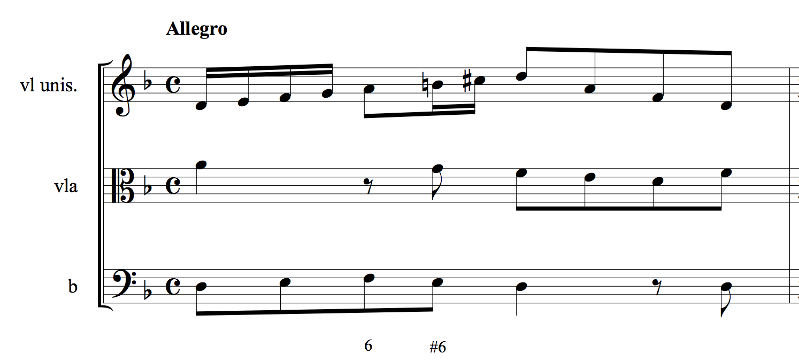
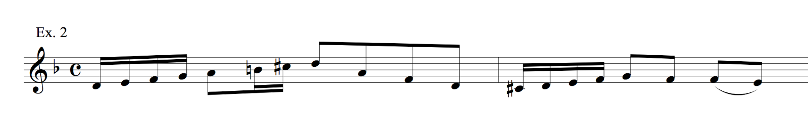
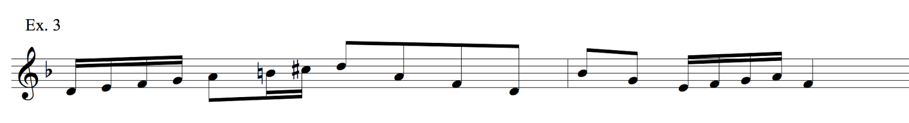
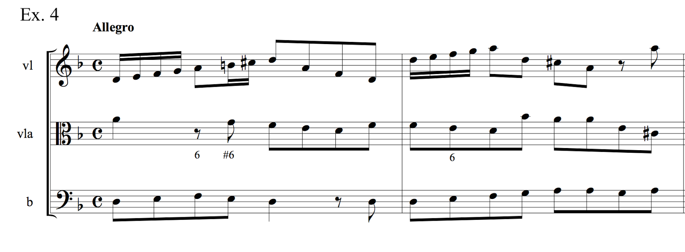

{{ page.title }}
================
**{{ page.author }}**

Analysis is still the high point of music theory education. We treasure those epiphanies that come from giving names to ineffable things we felt strongly about, or making connections between parts of a piece that seemed totally unrelated. But for students who are not predisposed to be amused by high-level abstractions, analysis can be pretty boring. From them we are content to ask for right-or-wrong identifications (e.g., “where does the second theme start?” or “how should this chord be respelled?”). Of course such identifications are necessary, they are in the back of the mind of the person who is about to have a real insight, but everybody knows how trivial they are. Students who are faced with such mechanical labeling exercises are bound not to feel engaged.

Lately I have experimented with using improvisation as a step towards analysis in an upper-level undergraduate class. This experiment involves applying the “see what an ass I am” method that I use to get students to generate model compositions. (I have described this method and explained its derivation from a Mozart letter in [Schubert 2011](http://jmtp.ou.edu/journal-article/global-perspective-music-theory-pedagogy-thinking-music). The method is enacted in four YouTube videos: [Part I](http://www.youtube.com/watch?v=YKcATH42tWU) and [Parts II–IV](https://www.youtube.com/watch?v=1r0DODEf_po&index=1&list=RD1r0DODEf_po).) In this method, the teacher (emulating Mozart) presents the student with a bit of melodic material and asks for a continuation. The task is low-pressure (there is no right or wrong), takes little time, draws on the student’s intuitions, and produces material for the whole class to sing, write down, and talk about.

When applied in an analysis class, it works like this: the teacher presents some very short fragment of the piece to be analyzed, and simply asks the students to improvise some material in response. The short fragment can be the first measure, as in the example that follows, but it can also be the melody without the harmony, or just the bass line, or just the rhythm without the notes, or just the notes without the rhythm, and so forth. This decision is made on the basis of what the teacher wishes to emphasize.

In a class on analysis of Baroque music, I presented the students with the first measure of an Albinoni ritornello, shown in Example 1. They sang the melody, then the melody and the bass.

**Example 1.** *The opening of the tenor aria “se incontrate tempeste” from the serenata* Il nascimento de l’Aurora*, taken from [Michael Talbot 1990](https://openlibrary.org/works/OL12411555W/Tomaso_Albinoni), p. 49.*

Then I asked individual students to invent a continuation for the melody. A couple of solutions similar to theirs are shown in Exx. 2 and 3. In a hypothetical discussion, the students might notice that the first echoes the ascending sixteenths on the downbeat and leads to a half cadence with appoggiatura, while the other shifts the sixteenths to the second beat and leads to an imperfect authentic cadence (or a move to III?). The relative merits of these features can be discussed without declaring either the winner.

**Example 2.**

**Example 3.**

Then the teacher or a student can improvise a bass under each solution. Both of these solutions cadence on the third beat of the second measure—in fact, six out of the seven students in the class cadenced there. This might be because after the first student had done it, everybody else went along, or it might be because of some other shared intuitive assumptions. Only one student went into a *Fortspinnung* right out of the gate.

The point is that each student had engaged with the material itself, not with some words about the material. Only after they have found solutions are they allowed to talk about them. We can ask, for instance, what does it mean to cadence on the third beat of the second measure? Well, for one thing the cadence forms a two-bar phrase that is complete within itself, establishing the tonic and providing room to breathe before the next thing. What other pieces do that? Well, two well-known ritornellos of Bach do: one from the first movement the Fifth Brandenburg and one from the chorale prelude “Wachet auf.”

Finally we looked at what Albinoni had done, shown in Ex. 4. This was a surprise— nobody had dreamed of repeating the motto an octave higher. We discussed what conclusions could be drawn from this expansion of register—would it become an important element later on? Well in fact the rest of the ritornello stays up there, and the first measure is the anomaly. What is the effect of the half cadence having no appoggiatura? Well, it makes the music less graceful and more emphatic (perhaps to reflect the “stormy” text) and works better at a fast tempo. The students actually felt that their continuations were as good as Albinoni’s. The nice thing about looking at slightly less-than-genius-level music is that the students feel that their solutions are valid alternatives. ([Christoph Neidhoefer and I](https://openlibrary.org/works/OL1894222W/Baroque_counterpoint) have argued for not using much Bach in elementary tonal counterpoint writing because most of it is too complex and potentially overwhelming.)

**Example 4.**

After discussing the various improvised versions and Albinoni’s *Vordersatz*, one could continue, improvising sequences based on the opening material, and then critiquing Albinoni’s sequences. (The *Vordersatz–Fortspinnung–Epilog* typology was [coined by Wilhelm Fischer](http://www.jstor.org/stable/41460317). 

One novelty of this approach is that students don’t begin by listening to the piece, as is so often the case in analysis classes. I have three reasons for insisting on this: First, singing is a more personal and physical involvement with the music. Second, the whole piece is too much information—responding to a small amount of music gives students a sense of control. Third, they don’t know what to focus on, and if they were provided with “guided listening” questions, they would tailor their response to the questions and not engage their own spontaneous musical response. This response in in music, not words, and in most cases will involve many musical features at once (melody, rhythm, motives, register, etc.).

(That said, I must admit that I have seen the listen-first method used to great effect by my thesis adviser Patricia Carpenter. She would often play a fairly long excerpt and ask students to note when they had “tuned out,” or simply what struck them. I remember a Barnard undergraduate saying, of a piece by Bach, “it sounds like God.” All the other students rolled their eyes, but Pat pressed on, asking, “What do you mean, Miss \_\_\_\_\_?” and generating a serious discussion from an apparently naïve response. But that kind of virtuoso teaching is not for everybody, and is very talk oriented.)

Too often we take the composer’s genius for granted, assuming that the finished piece just had to be that way. However, realizing that the composer had to choose between alternatives lets us appreciate the final result better, and our students’ hypothetical musical responses open up a world of alternatives. I hope to have suggested here a way to get students involved in the analysis project by putting them in the composer’s place. As for listening, after they have become familiar with the piece from taking it apart and trying to repair it with their own homemade materials, then when they listen to it they will remember and recognize the moments where the composer may have made a choice, and they will have a basis from which to make even more observations that can lead to real epiphanies.

This work is copyright ⓒ2014 Peter Schubert and licensed under a [Creative Commons Attribution-ShareAlike 3.0 Unported License](http://www.google.com/url?q=http%3A%2F%2Fcreativecommons.org%2Flicenses%2Fby-sa%2F3.0%2F&sa=D&sntz=1&usg=AFQjCNG4j2oPozXv2_VqmmLiVAToFtwKdA).
