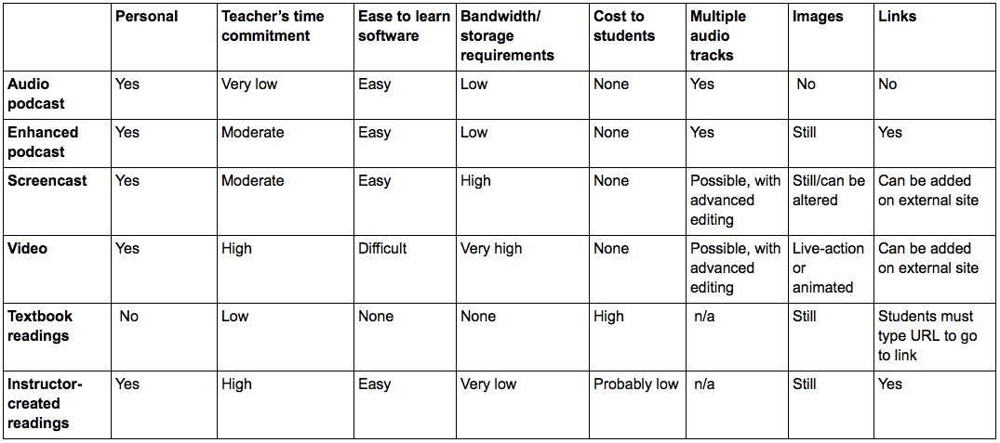
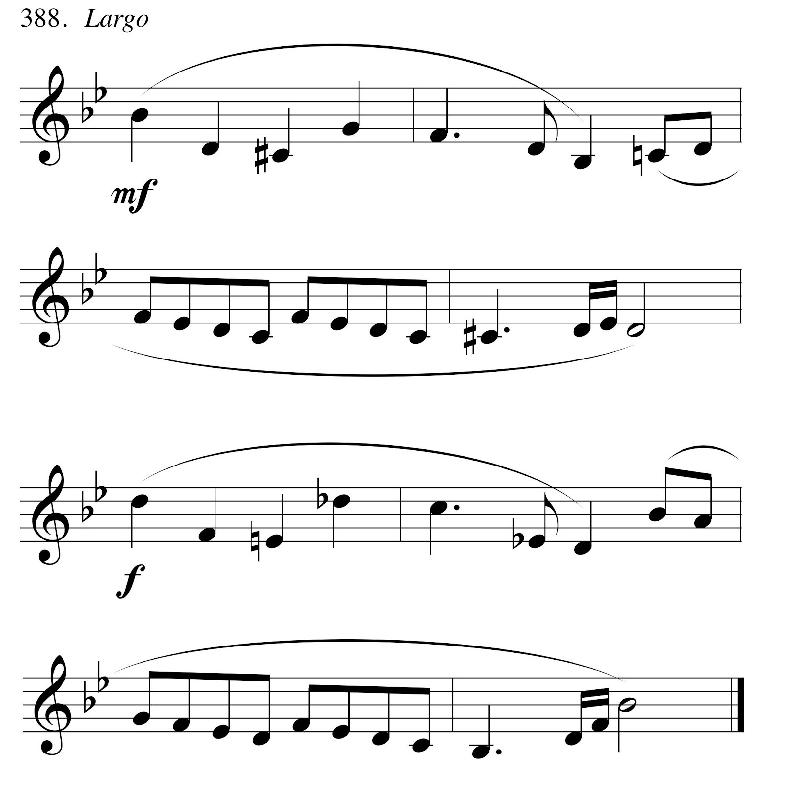
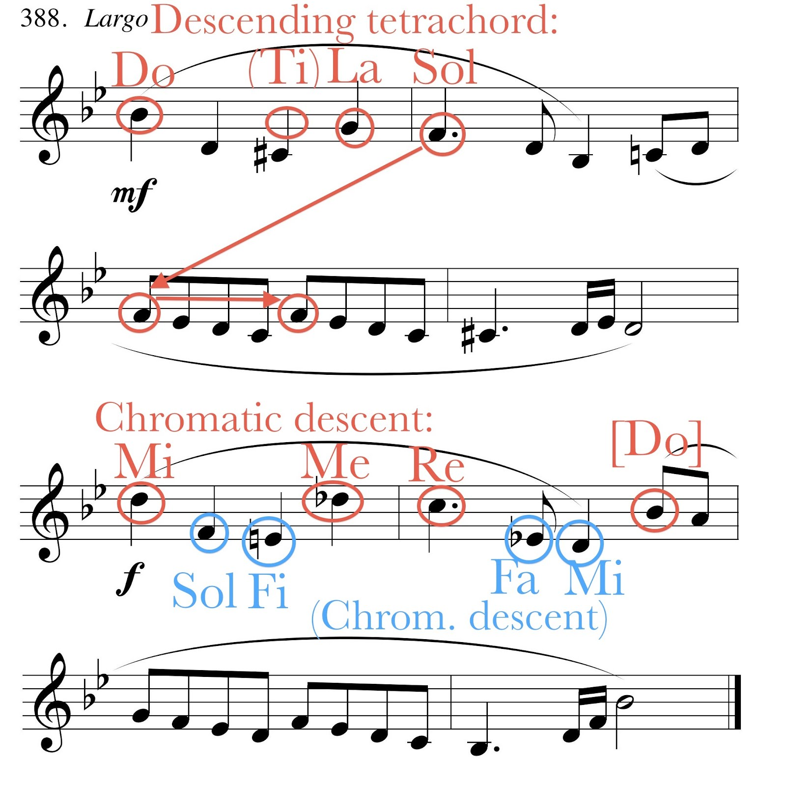
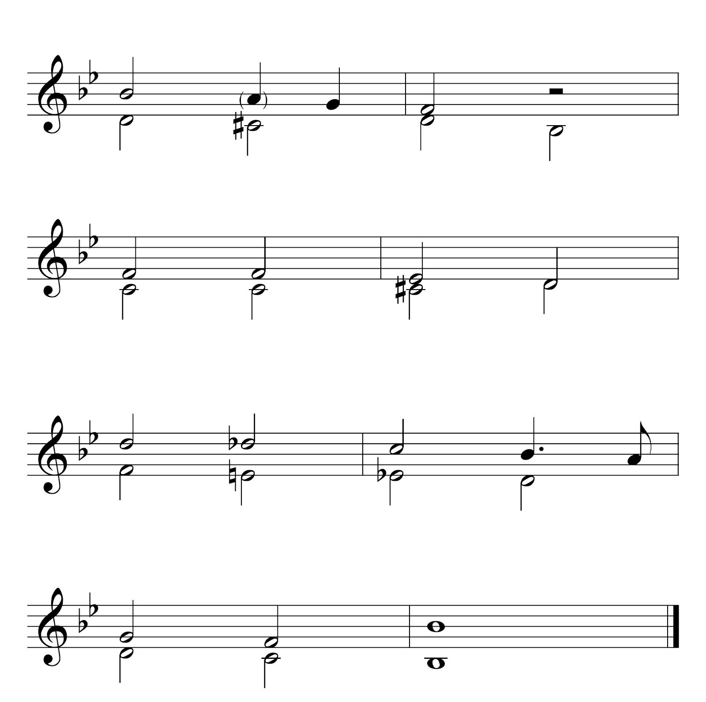

{{ page.title }}
================
**{{ page.author }}**

Introduction
============

[Shaffer and Hughes](http://www.google.com/url?q=http%3A%2F%2Fwww.flipcamp.org%2Fengagingstudents%2Fshafferintro.html&sa=D&sntz=1&usg=AFQjCNHdo8F-0-l1EfsZ7XkcIsQnd1IutQ), [de Clercq](http://www.google.com/url?q=http%3A%2F%2Fwww.flipcamp.org%2Fengagingstudents%2FdeClercq.html&sa=D&sntz=1&usg=AFQjCNFS5ln7dEHE87dnYbodtijucAWSaw), and others have shown that the inverted teaching model holds great promise for academic music classes such as theory and history. I have started recently to incorporate this approach into my own theory teaching, with an encouraging degree of success. This essay focuses on the enhanced podcast, one tool I have used in my inverted classes and as a supplement in my traditional classes. Like a traditional audio podcast, an enhanced podcast can include pre-recorded or instructor-created audio; the “enhancements” are images and web links. This format allows students to consume content (that is, the theory, history, or ear training material) at their own pace in an accessible, personalized manner. As [Black](http://www.google.com/url?q=http%3A%2F%2Feric.ed.gov%2F%3Fid%3DEJ872487&sa=D&sntz=1&usg=AFQjCNFe8HDTUcgFxiePmkBBklpbZ9if3Q) and others note, electronic formats are especially appropriate for the millennial generation, but they are potentially useful for all students. Figure 1 compares features of various content-delivery formats for academic music classes; the enhanced podcast occupies a nice middle ground between textbooks and screencasts/videos. It is very inexpensive and personal, yet bandwidth demands and instructor time commitment are relatively low.

**Figure 1.** Features of various content-delivery formats.

Examples of applications
========================

Enhanced podcasts can be useful throughout the typical university music curriculum for classes such as fundamentals, ear training, tonal theory, form and analysis, post-tonal theory, and music literature and history. Below, I describe enhanced podcasts for three of these classes: fundamentals, form and analysis, and ear training.

**Music fundamentals.** Enhanced podcasts are particularly appropriate for music fundamentals topics, as they allow students to work repeatedly through material at their own pace. Many of my students have reported how important this flexibility is to them. [Example 1](https://docs.google.com/file/d/0B0rOIBDWklVoTTlzaTlzeGtpNVE/edit) is an edited version of an enhanced podcast introducing roman numerals (RNs). My goal was for students to come to class understanding the basic elements of roman numeral analysis in major keys. For each diatonic triad, I wanted students to know its typical quality, its moveable-do solfège syllables, how to write its roman numeral, and its name (e.g., ii is the supertonic triad). Building upon students’ prior knowledge, I created a podcast consisting of the components shown in Figure 2.

**Figure 2.** Contents of longer version of Example 1.

[Click here for full table.](SRFigure2.html)

After assigning the enhanced podcast, I started the next class with a mini-quiz, which takes only a few minutes to administer and about 10 minutes to grade. Mini-quizzes are easy for students who watched the podcast. They effectively hold students accountable, which I have found vital for success in my inverted teaching. For the remainder of the roman numeral lesson, students completed a worksheet with similar examples, and then learned a more sophisticated application of the concept: combining roman numerals with figures that indicate chord positions.

**Form and analysis.** In an upper-level form and analysis class, it can be very difficult to get students to make the transition from the narrowly detailed focus typically emphasized in lower levels to the bigger-picture view necessary to understand complete movements. The audiovisual form chart, which eliminates musical notation altogether, can be very helpful in this regard. [Example 2](http://www.google.com/url?q=http%3A%2F%2Fenhancedpodcastsmusicclassroom.blogspot.com%2F2014%2F07%2Fexample-2.html&sa=D&sntz=1&usg=AFQjCNGMLC3CsFMYTnjQt9n1_PsnBo4wOA), an enhanced podcast introducing a unit on sonata form, demonstrates. (Other programs that can be used to make form charts are [Variations Audio Timeliner](http://www.google.com/url?q=http%3A%2F%2Fvariations.sourceforge.net%2Fvat%2Findex.html&sa=D&sntz=1&usg=AFQjCNGhq0DvYQgwyxcNxrA4HHCXErMobw)and [Audacity](http://www.google.com/url?q=http%3A%2F%2Fwww.flipcamp.org%2Fengagingstudents%2Fpeebles.html&sa=D&sntz=1&usg=AFQjCNE8NUmnYZRGs7F-sW3j3Sxp01c2Bg).) I start with a brief overview of typical formal features, and give suggestions--spoken and bullet points--about what students should listen for. Then a recording of the first movement of Mozart’s Serenade, K. 525, is annotated with the large-scale sections of the form as well as a few elements of each of the smaller thematic areas (such as its phrase structure, texture, and cadences). Each large section has its own color to help students keep track of the form. I encourage students to navigate through chapters to compare occurrences of the themes, so they can discover similarities and differences. In a future iteration of this podcast, I am considering adding spoken annotation to the text.

**Ear training.** As [Trevor de Clercq](http://www.google.com/url?q=http%3A%2F%2Fwww.flipcamp.org%2Fengagingstudents%2FdeClercq.html&sa=D&sntz=1&usg=AFQjCNFS5ln7dEHE87dnYbodtijucAWSaw) notes, the ear training classroom also provides opportunities to invert instruction. Here, enhanced podcasts can prove especially useful in helping instructors manage the ever-too-limited class time, by supplementing both performance and listening activities. An enhanced podcast can combine aural and visual modalities in helping students prepare a melody for performance, especially one that has features not immediately apparent. For instance, Example 3a can look intimidating to students who do not perceive the underlying linear connections between nonadjacent notes. A podcast including annotations (such as those in Ex. 3b, which may accumulate gradually) and the intervallic reduction (Ex. 3c) will help students understand the underlying structure, (hopefully) allowing them to transfer this procedure to new melodies.

**Example 3.** A compound melody for performance (from [Berkowitz et al,](https://www.google.com/url?q=https%3A%2F%2Fopenlibrary.org%2Fworks%2FOL16010686W%2FA_new_approach_to_sight_singing&sa=D&sntz=1&usg=AFQjCNGQ-UXOOBwtXfkvvP0xkspyvaDOjQ)[A New Approach to Sight Singing](https://www.google.com/url?q=https%3A%2F%2Fopenlibrary.org%2Fworks%2FOL16010686W%2FA_new_approach_to_sight_singing&sa=D&sntz=1&usg=AFQjCNGQ-UXOOBwtXfkvvP0xkspyvaDOjQ))

3a. Melody as written, including chromatic leaps

3b. Annotated melody. The annotations may be presented incrementally.

3c. Intervallic reduction

Similarly, enhanced podcasts can provide students with effective strategies for focusing on particular elements of a dictation exercise in a low-stress situation outside of class time. Especially beneficial would be a podcast containing a dictation exercise with various “hints”--using any combination of graphics, printed text, and audio--in the different chapters. This would allow students to focus individually on whichever elements they find most useful.

Making and distributing enhanced podcasts
=========================================

There are two easy ways to create an enhanced podcast. Instructors with Apple computers can use GarageBand. Instructors without access to this program may use a browser based program requiring no additional software beyond basic audio recording/editing.

**GarageBand.** [Older versions of Apple’s GarageBand](http://www.google.com/url?q=http%3A%2F%2Fsupport.apple.com%2Fkb%2FHT5971%3Fviewlocale%3Den_US%26locale%3Den_US&sa=D&sntz=1&usg=AFQjCNH53tQp5Us1W5NhKUpx3D5DWxTsVQ)[ software](http://www.google.com/url?q=http%3A%2F%2Fsupport.apple.com%2Fkb%2FHT5971%3Fviewlocale%3Den_US%26locale%3Den_US&sa=D&sntz=1&usg=AFQjCNH53tQp5Us1W5NhKUpx3D5DWxTsVQ) offer an excellent balance of functionality and ease of use. The program’s audio capacity allows more tracks than instructors will possibly need, and manipulations such as duplicating, cutting and copying, fading, balance, and level are accomplished with just a few clicks. Instructors can add images (which are created and edited outside the program) by dragging and dropping. Once a podcast is created, the program can export it into the correct format. Appendix 1 provides instructions.

**Auphonic/Podigee.** Instructors without access to GarageBand can make enhanced podcasts online using the browser-based programs [Auphonic](https://www.google.com/url?q=https%3A%2F%2Fauphonic.com%2Flanding&sa=D&sntz=1&usg=AFQjCNFgIHOoi9BIEMOgBITIINc359PQBw) or [Podigee](https://www.google.com/url?q=https%3A%2F%2Fwww.podigee.com%2Fen%2Fhome&sa=D&sntz=1&usg=AFQjCNFaTIx-78Bfi1GSTiHN1t2GnXqmUw). Both operate on the “Freemium” pricing model and allow users with a free account to create either one (Podigee) or two (Auphonic) hours of podcasts per month. To create a podcast using either of these services, a user will create the audio track offline (using software such as [Audacity](http://www.google.com/url?q=http%3A%2F%2Faudacity.sourceforge.net&sa=D&sntz=1&usg=AFQjCNGfhEWoDNzU1waXp73d8oqSHacSZw)), upload it, and add images and links, manually setting the timing for the enhanced features. Podigee offers the additional benefit of hosting the podcast; readers may find a brief sample in [my podcast feed](http://www.google.com/url?q=http%3A%2F%2Fanna-stephan.podigee.io&sa=D&sntz=1&usg=AFQjCNFkgkNQmBA9aRvzQ_0t4-Ein0yvrQ). Auphonic has a further benefit--an automatic post-production algorithm that improves audio quality. Additionally, Auphonic offers a free, limited-functionality app for mobile devices (iPhone, iPad, Android), allowing users to make podcasts on-the-go.

**Distributing enhanced podcasts.** The easiest way to distribute an enhanced podcast is via a learning management system, from which students will download the file and open it in iTunes, from there transferring it to a mobile device if desired. Alternatively, instructors can create a podcast feed and [submit it to](http://www.google.com/url?q=http%3A%2F%2Fsupport.apple.com%2Fkb%2FHT1819&sa=D&sntz=1&usg=AFQjCNHbbI8oXNPTaeLpGll27IqMCsLqog)[iTunes](http://www.google.com/url?q=http%3A%2F%2Fsupport.apple.com%2Fkb%2FHT1819&sa=D&sntz=1&usg=AFQjCNHbbI8oXNPTaeLpGll27IqMCsLqog), or host podcasts on a [blog](http://www.google.com/url?q=http%3A%2F%2Fenhancedpodcastsmusicclassroom.blogspot.com&sa=D&sntz=1&usg=AFQjCNGVXPszg8gdewC4c-XHs8L-bCLWzw). In the latter case, the podcasts will appear as videos and any links must be added manually. [Appendix 2](https://drive.google.com/file/d/0B0rOIBDWklVodld1VTZZZWdacWs/edit?usp=sharing) shows how students can watch an enhanced podcast.

Closing remarks
===============

My recent experimentation with the inverted classroom model has inspired me to continue using this method in my music theory and aural skills classes. Although time will show whether my students retain knowledge and skills better than those I taught more traditionally, I have received much positive feedback, and my students seem more engaged in the courses. I certainly enjoy teaching more when I can interact with students more directly, and observe them interacting with one another. Enhanced podcasts facilitate this interaction during class time.

I have found the enhanced podcast a useful component of both my inverted and more traditional teaching. Its benefits include the possibility of multiple simultaneous audio tracks, a relatively small file size, easy navigation for students through the chapter menu, web links, and ease of editing. Enhanced podcasts can engage students’ auditory, visual, and verbal senses, giving each student multiple opportunities to learn music in whatever ways work best for that individual. Students can repeatedly watch an enhanced podcast and navigate with ease to the most useful parts, allowing them to learn at a self-directed pace. By embracing the enhanced podcast along with other delivery formats, we instructors give ourselves one more tool to help reach every student.

This work is copyright ⓒ2014 Anna Stephan-Robinson and licensed under a [Creative Commons Attribution-ShareAlike 3.0 Unported License](http://www.google.com/url?q=http%3A%2F%2Fcreativecommons.org%2Flicenses%2Fby-sa%2F3.0%2F&sa=D&sntz=1&usg=AFQjCNG4j2oPozXv2_VqmmLiVAToFtwKdA).

## Appendix 1: Steps to create an enhanced podcast using GarageBand.

[PDF outlining steps](https://drive.google.com/file/d/0B0rOIBDWklVoN3M5ZElNU0RVSEU/edit?usp=sharing).

Video demonstration:  
[Step 1](http://youtu.be/fXGU7KB3SUM)  
[Step 2a](http://youtu.be/VqinkSGXuJc)  
[Step 2b](http://youtu.be/tISZpp9idKI)  
[Steps 3 and 4](http://youtu.be/HhlM2XG1Sxk)

